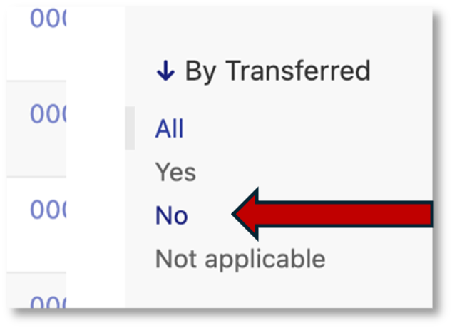

.. _allocation:

Allocation to subjects / patients
=================================

The next step is to allocate physical stock to your patients as per the Stock request. In our example, we will be allocating the 48 bottles in the request we just prepared.

When you allocate stock to patients, you are linking an unallocated bottle with a subject listed on the request.

To allocate stock to patients go back to ``Manage requests`` on the main menu:

You will come to the ``Request for stock page``.

Find your request, tick one box on the left to select:

Select ``Allocate stock`` on the action menu and click ``Go.``

.. image:: images/allocation_select_request2.png
   :width: 400

Of the 48 bottles in the request some are Active IMP and some Placebo. Choose either Active or Placebo to start. Let’s start with Placebo. Select Placebo and click submit.

You will come to the Allocate stock to subjects from stock request  page:

Line up 12 bottles and scan them in. Once complete you will return to the Request for stock page. Notice the status column shows the number allocated:

Click on the Stock link to view these items. Filter the list using the By transferred filter on the right sidebar. Click No.

Using the box on the left side of the page to select all the items

From the action menu select Print labels and click ``Go``.

The labels print in alphabetical order by stock code. Carefully affix the labels to the matching bottles covering the blank part of the stock vertical barcode label with the patient barcode label. When affixed it should look like this:

