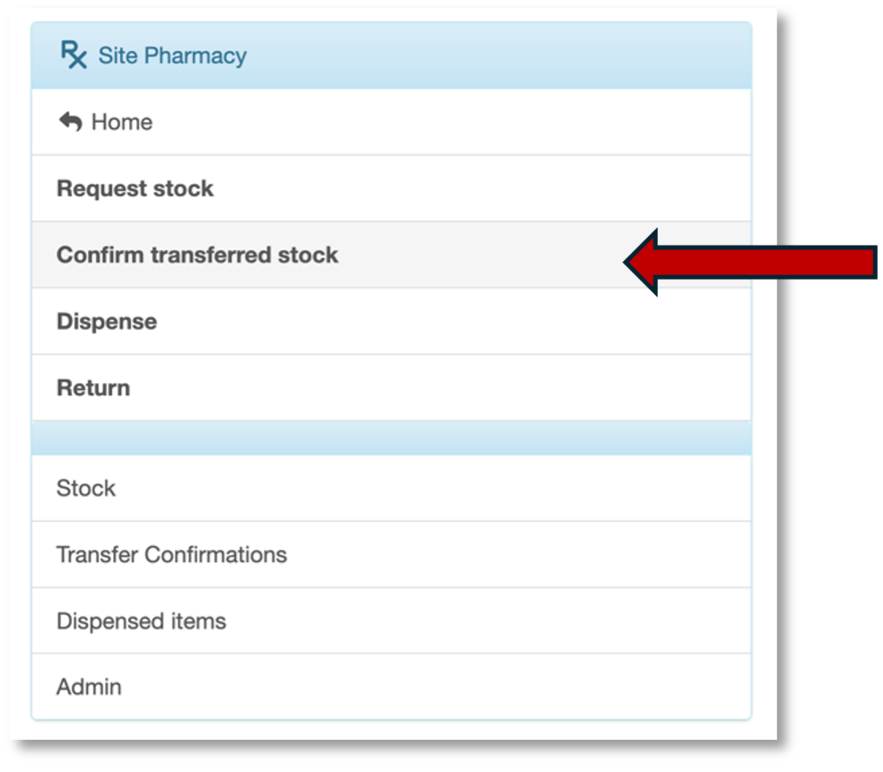
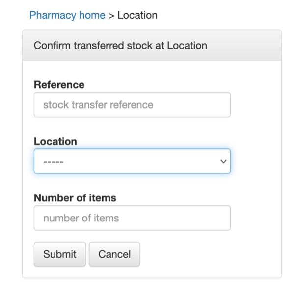
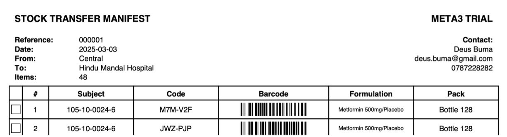

Confirm transferred stock (at the site)
=======================================

When study medication is delivered (or transferred) from the Central pharmacy to the site, you need to confirm receipt of the study medication. In the consignment you should find a Stock transfer manifest.  Use the information on the Stock transfer manifest to update the EDC.

.. important::
    This task is done by a user with the Site Pharmacist Role.

Go to the ``Confirm transferred stock`` on the main menu.

This opens the ``Confirm transferred stock at location`` page

Reference the Stock transfer manifest

and transcribe the reference number, location and number of items from the Stock transfer manifest

Click ``submit``

.. attention::
    next steps to be written
