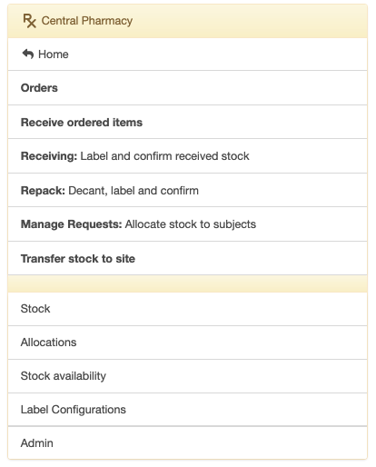
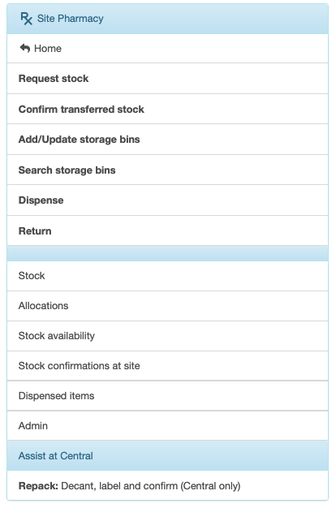

Getting started
===============

The Pharmacy section of the EDC is access by clicking RX on the top menu.

If your user account includes the ``Pharmacist role``, you will be taken to the Central Pharmacy menu:

The central pharmacist prepares medication and distributes it to the study sites.

.. important::

    The central pharmacist is unblinded.

If your user account includes the ``Site Pharmacist role``, you will taken to the Site Pharmacy menu:

.. important::

    The site pharmacist is blinded.

For now, let's go over what happens in the Central Pharmacy.

Central Pharmacy
----------------
The opening Central Pharmacy menu lists the documents and tasks in the sequence that they are completed. That is, start with an order, add items to the order, receive the ordered items in bulk and decant, or repack, the medication into patient bottles; for example, repack into bottles of 128 tablets. Let’s start with that and get to the rest later.

You will see as we move through the steps, that every item created or added to the EDC Stock will represent a physical stock item with a label. You create the Stock item on the EDC, print a label, affix the label to the physical stock item and scan the label back into the EDC. That last step, scanning the label back into the EDC, confirms the Stock item referred to in the EDC exists. If you skip the last step, the Stock item will show in the EDC as unconfirmed, and you will not be able to do anything with it.

For example, if you have ordered IMP and receive 42 buckets of Active IMP you will print 42 labels, affix the labels to each bucket and scan the labels back into the EDC to “confirm” the Stock items. Once the buckets are labelled and confirmed, you can proceed to the next step of repacking the tablets into bottles of 128. If a bucket has not been confirmed, you will not be able to move to the repack step.
