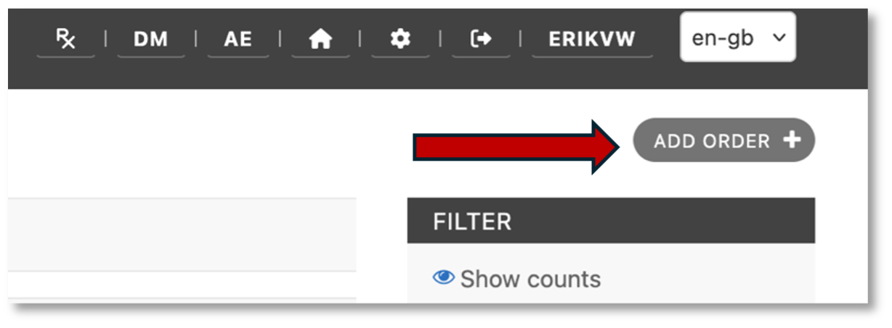
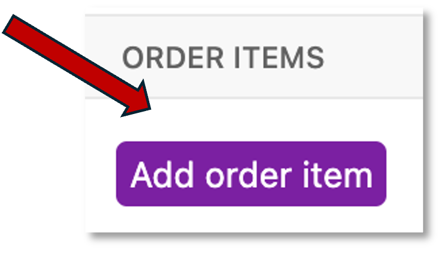
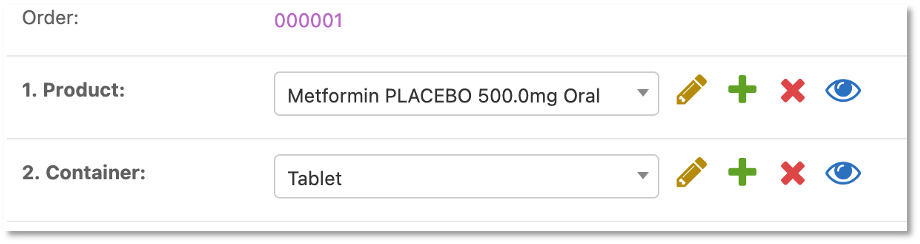
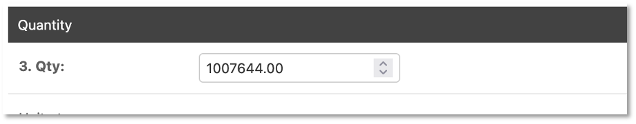

Orders (from supplier to central)
=================================

To order new IMP, complete the ``Order`` document. This document will consist of the ``Order`` document and its corresponding ``Order items``. Most orders to the supplier list one item for Active IMP and a second item for Placebo. The ``Order item`` (e.g. Active IMP) records the assignment (Active/Placebo), batch/lot number, date of manufacture, process until date, expiry date and other details. The batch number, assignment and the expiry date are the most important values as you move forward in the processing steps.

Order
-----
Begin by select ``Orders`` on the main menu:

.. image:: images/orders_menu.png
   :width: 300

and ``Add order`` on the right.

Enter an order for study medication. An order usually has 2 line-items: one for Active and another for Placebo.

Click ``Save`` to save the ``Order``.

You will now see a highlighted button, ``Add order item``, in line with the ``Order`` just created.

Click ``Add order item`` to fill in the document.

Order items
-----------
Each order contains ``order items``. The number of items is recorded on the order. To start, record the Product and Container. In this case the container is unknown until receiving so select tablet and enter the number of tablets on order.

Enter the quantity of tablets on order and click ``Save``.

