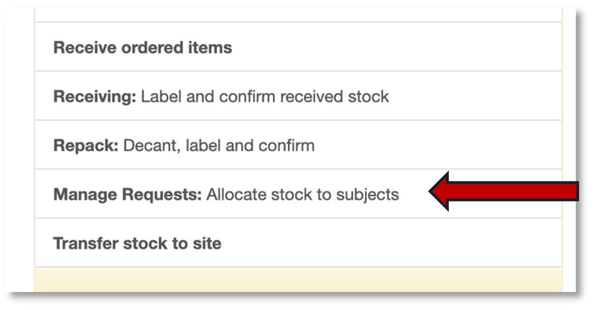
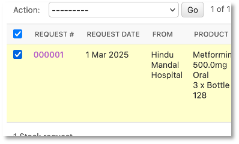
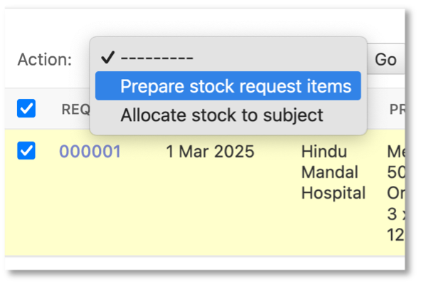
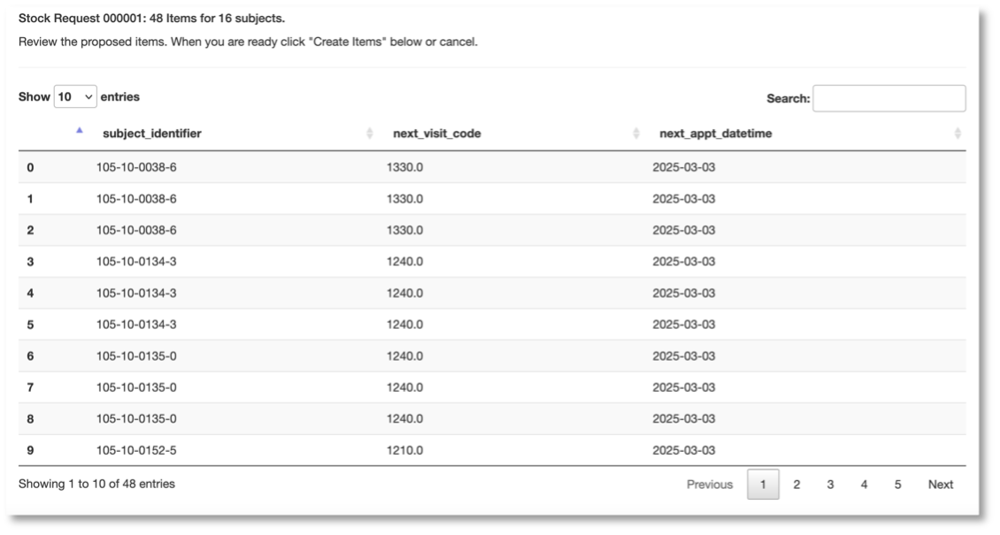
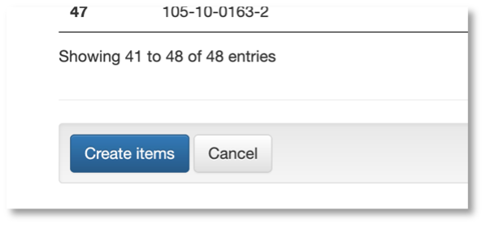
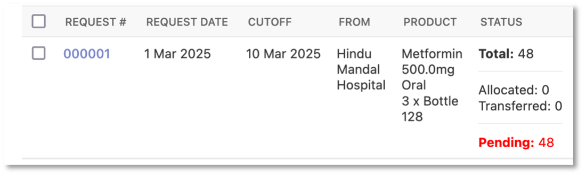

.. _prepare_stock_request:

Prepare a stock request
=======================

After a stock request is received from the site, you need to prepare the stock items for the request. Start by going to Manage requests on the main menu:

This takes you to the ``Request for stock`` page. Select the request by ticking the box on the left of the record:

Select ``Prepare stock request items`` on the action menu and click ``Go``.

You will come to a page where you can review the proposed stock request items for this stock request.

Review the items and click the ``Create`` just below the table:

By clicking Create you are adding the items listed on the review page the stock request. When the EDC is done, you will be returned to the Request for stock page. Note the number created in the Status column.

In the above, a total of 48 items were created. No bottles have been allocated to a subject and no bottles have been transferred to the site from the central pharmacy.
