.. _repack:

Repack (Decant from bulk to patient bottles)
--------------------------------------------
Repacking starts from the main Stock table.

Bulk stock needs to be decanted into patient bottles by the process until date recorded in the receiving document. In your work area do not work with Active and Placebo in the same space and at the same time. Let’s start with Active.

Select Stock on the main menu.

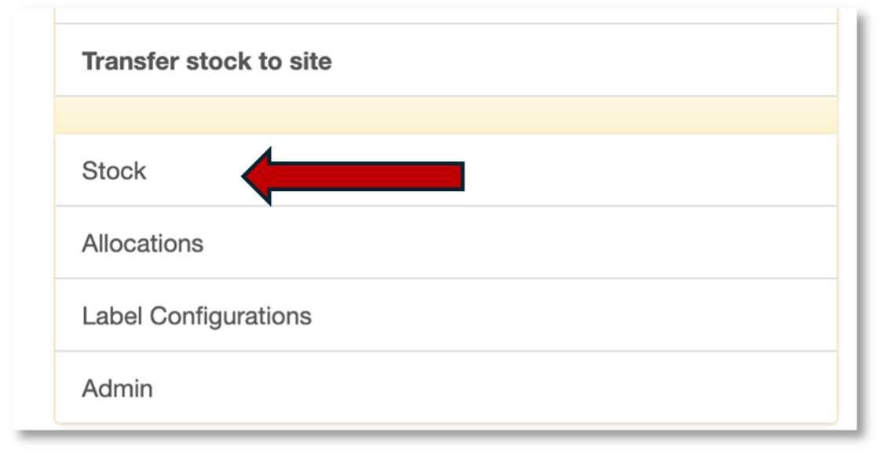

In the search bar, scan the barcode of the bulk item. For example, the bulk item might be a bucket of 16550 tablets of METFORMIN ACTIVE.

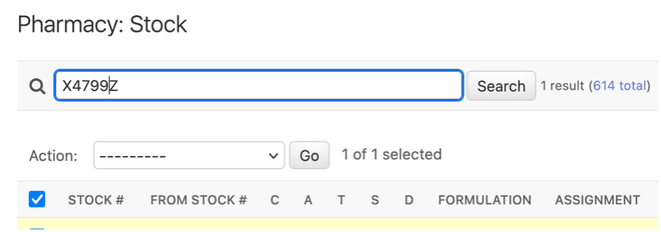

On the left, tick your bulk item. Note that the bulk item must be confirmed before you can repack.

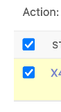

Select the ``Repack stock`` action and click Go.

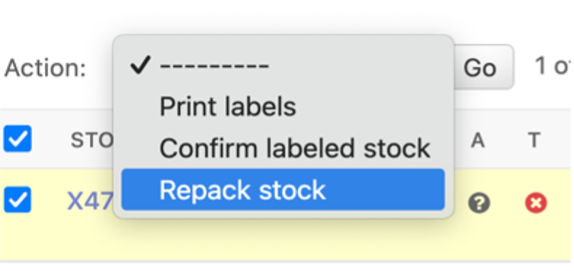

You will come to the repack request document. Some values are prefilled. You need to select the Container and Containers requested. The container is the bottle (Bottle 128) and the containers requested is the number of containers decanted from the bulk item. For example, if the bulk item had 16550 tablets, you would expect 129 bottles of 128 tablets each. Containers requested is then 129.

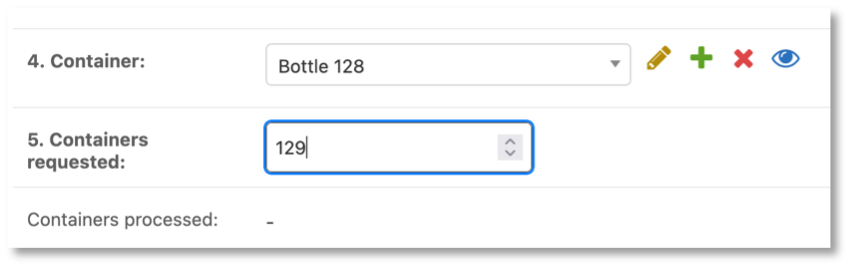

Click save. Be patient it may take a minute to process.

Next you will be returned to the list of Repack Requests. Select the one you just created. If you need help finding it, just go to the search bar and scan in your bulk stock code (X4799Z from the example above).

Tick the left box next to your Repack request, select Print labels and click Go.

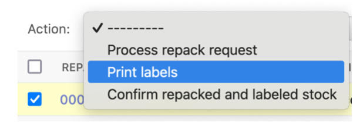

You will come to the Print labels screen. Select stock vertical barcode and click Print:

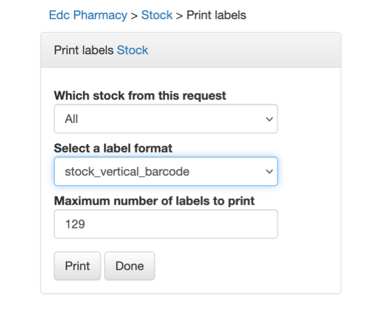

A PDF file will download to your browser. Open the PDF. There should be 129 barcodes
and each should look like this:

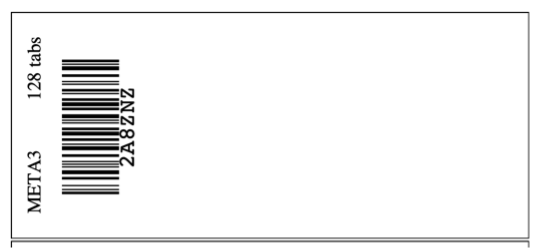

Print the PDF. Be sure your print settings do not scale to fit. The scale should be 100%.
In our example, we printed 129 labels. Retrieve the physical bottles decanted from the bulk item (X4799Z from the example above) and place one label on each bottle.

Once all the bottles are labeled go back to the EDC and go to Repack.

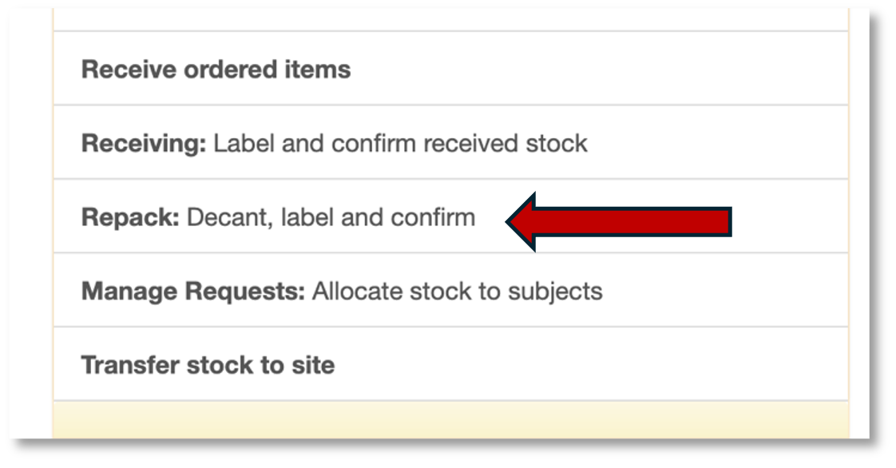

This will take you to the Repack table. In the search bar scan the bulk item stock code (X4799Z from the example above). Tick the left box next to your Repack request, select Confirm repacked and labelled stock and click Go.

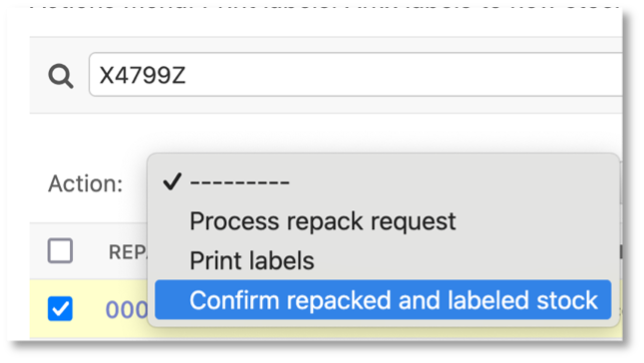

You will come to the Confirm stock page:

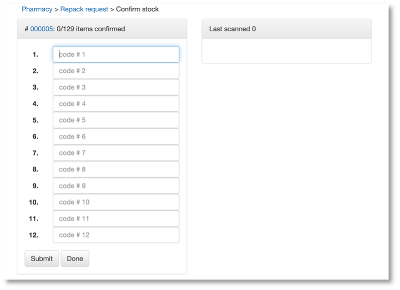

You may now scan the label on each bottle until all 129 are scanned and confirmed.
