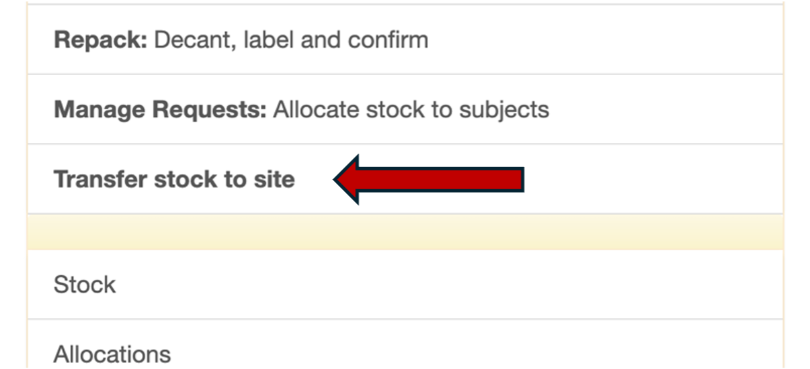
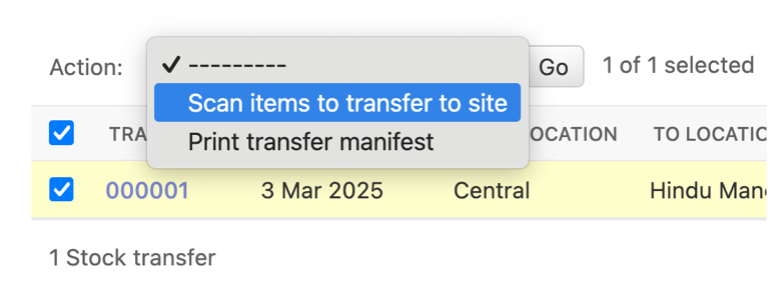
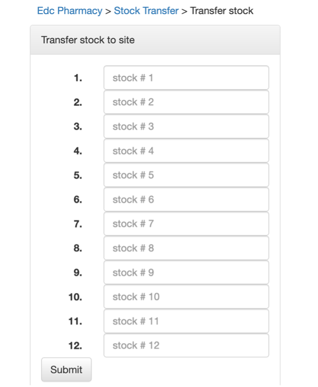
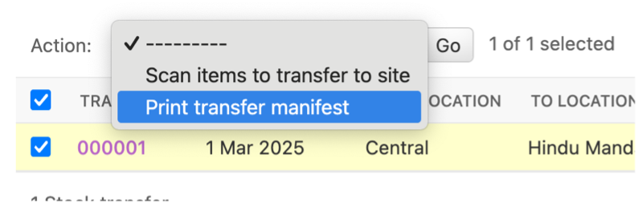

.. _transfer_stock_to_site:

Transfer stock to site
======================

After allocation, stock is ready to ship to the site. Select ``Transfer stock to site`` from the main menu.

You will come to the ``Stock transfer`` page. Select your transfer document by ticking the left side box. Select ``Scan items to transfer to site`` from the action menu and click ``Go``.

Scan the barcodes of the bottles you intend to transfer to the site

When you are done, print the transfer manifest

